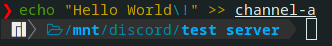

# discord-fuse
Mount a Discord account as a file system.

## Usage

This will create a sub-folder for every server the account is in and below that it will create a channel for every text channel the server has.

### Mounting
1. Create a mount point to mount the account to (e.g. `mkdir ~/discord`)
2. `DISCORD_TOKEN=YOUR_TOKEN_HERE cargo run -- /mnt/discord`

### Unmounting
Simply call `umount` on your mount point.

### Reading messages

Simply `cat` a channel or open it in the text editor of your choice. Please note that files will not be refreshed without being re-opened.

### Sending messages

You can just pipe a message into a channel.

## Showcase

## TODO
- fix timestamps
- figure out if there's a better way of doing dynamic file sizes (using 2**32 at the moment)
- DM support?